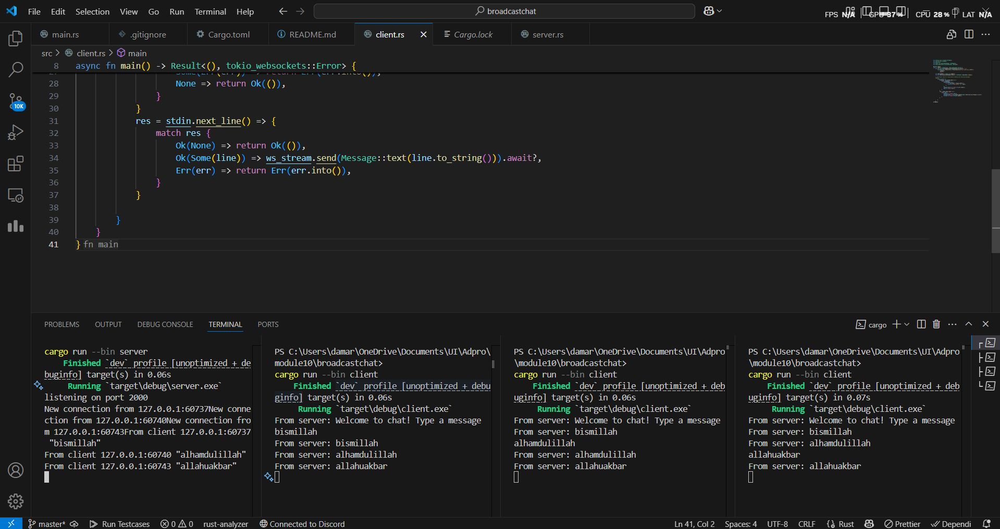
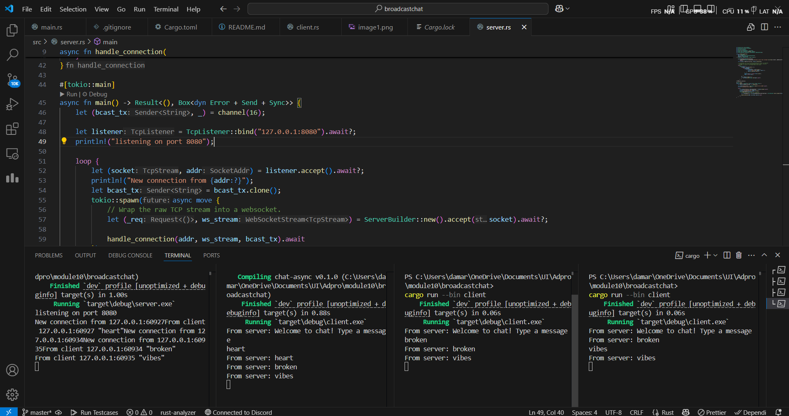

# Original code, and how it run

Open one terminal, start the server:

`cargo run --bin server`

You should see

`listening on port 2000`

Open one or more additional terminals and launch a client in each:

`cargo run --bin client`

Each client will print:

`From server: Welcome to chat! Type a message`

In any client, type a line and hit enter. For example:

`bismillah`

The server terminal logs:

`From client 127.0.0.1:XXXXX "bismillah"`

All connected clients will print:

`From server: bismillah`

Every time someone types, the server broadcasts that message to all subscribers via the broadcast channel, and each client’s select‐loop picks it up and prints it out.

# Modifying port

Because both the client and server are still using port 8080, the communication works just as it did before—nothing breaks or changes in functionality.